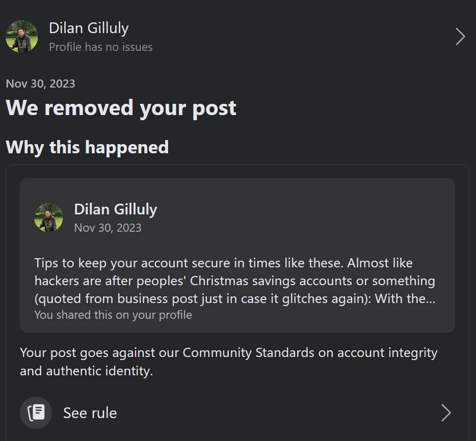
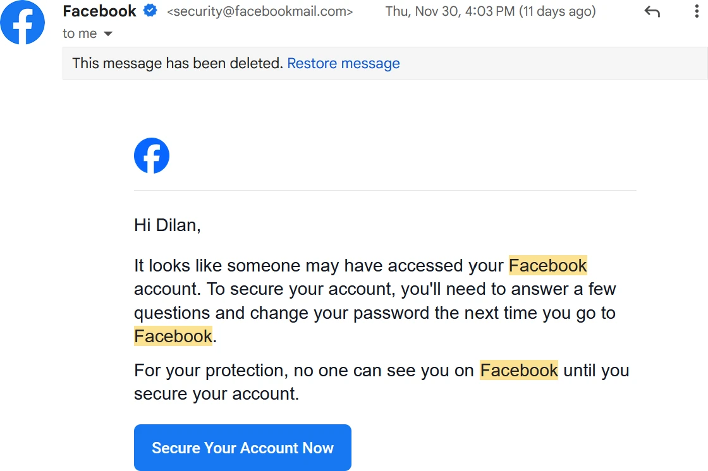
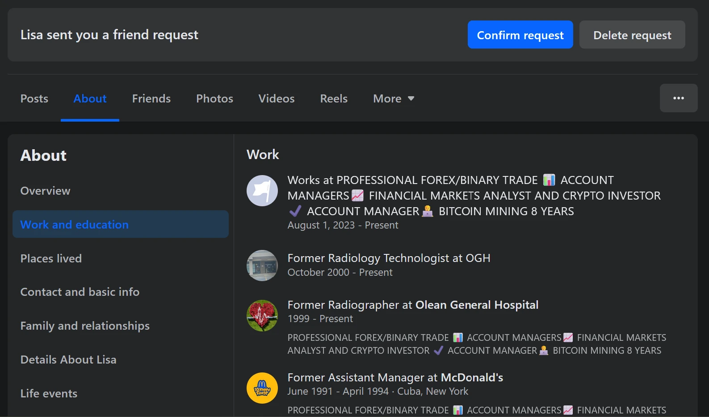
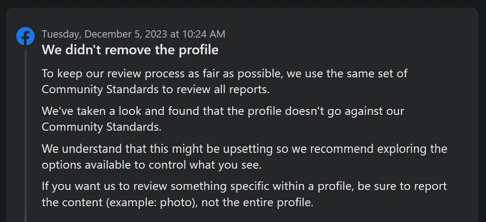

+++
date = '2023-12-11T10:26:04-05:00'
draft = false
title = "Why I'm reducing my Facebook usage"
+++

This essentially marks a year and a half I've been at bat against apparent misunderstandings on the behalf of Facebook's AI moderation technology, if that's not just one of their own lame duck excuses.

For those who may not have gotten the whole story, here goes:

<!--more-->

## Initial friction

A year and a half ago I shared a video link. To be honest, I didn't agree with some of the presented content of said video, but I shared it because one of the people being interviewed was an ex-addict who was critiquing San Francisco's response to their drug epidemic. Which is why I shared the video, it was interesting.

Facebook's AI immediately removed the video and jailed my account. I filed an appeal. Two days later they finally reviewed it, deciding to unjail my account. I had a feeling that since this whole debacle required human intervention on their behalf, and said content seems to transcend what certain left-leaning circles want people to understand.

And I don't actually want to admit that this self-admittedly paranoid outlook would turn out to be correct.

## First Anti-scam post

Earlier this year I saw in a group which had been abandoned by its admin, had been overtaken by a bunch of spam bots promoting some sort of Forex investment scheme. Since the group admin had been taking a leave of absence at the time, I decided to start reporting them to Facebook themselves.

It perplexed me when Facebook decided **not** to remove them at all and continue to allow these bots to post what was *clearly* a scam. So I decided to investigate further.

To make a long post short, what insued was the grim discovery that these "bot accounts" were once accounts belonging to real people who were phished out of them, and Facebook was sitting idly by and just allowing said scam operations to continue.

What insued was me becoming a mad-scientist in what was likely my first work of investigative journalism. [Read it here](https://www.gillulyit.com/articles/2023/05/facebook_scams.html).

When I tried to share and promote it on Facebook, they decided to blacklist the content and make it so I could not promote my business for a while.

This should have made it 100% clear that Facebook is actually siding with scammers in this internet war.

## Second Anti-scam post

Lately I decided to make a post on how to secure one's Facebook account, after seeing a bunch of people get phished out of their accounts. I do what I normally do and posted to my business's page and tried to share it to my personal page so my friends can see it.

For some reason Facebook's "Share post with link" feature wasn't working. So I copied and pasted the text of it into my post. Facebook immediately offlined it as a result. When I appealed, two days later they decided to remove all posts involved.

## Harassment that followed

In the days following that post, Facebook treated me like they should have been treating the accounts taken over by scammers. Including requiring me to reset my password no less than 3 times, while logging into the same three devices which I log into my account with (two computers running Firefox, and my one Android phone), deeming all of my human activity as "suspicious" and "bot-like."

So for almost a week after I could not enjoy the luxuries like being auto-logged in on my phone, or any of my computers. Any attempt to use my account I had to sign in, get that email, use it to reset my password, sign back in, and be able to use it to post and share memes for 10 minutes.

## Not removing a phished account

Someone I knew got hit by this particular round of phishing. And they made a new account, advising people to remove their old one. Well, whoever was running their old one at the time immediately sent me a friend's request after removing it. I could see that they had changed everything to be Forex/Bitcoin trading in the job details.

After seeing that I decided to report the account as being phished. About a day and a half later I get the following notification:

Which I laugh not because it's funny but because how incredibly frustrating it is. Here they tout "We use the same fair community standards and moderation policies" when that is factually not true in the slightest.

## Why Facebook doesn't act

One thing that keeps reeling through my mind in all of this and it justifies the lame-duck moderation policies that seems to be plaguing social media sites in the modern day, is how they make money off of scammed accounts.

Whenever an account gets scammed out of the hands of its rightful owner, that person will then make another account. In return, the scammer will still run the person's "old" account.

This makes one active person look like two, and seem like two enough to fool a lot of investors who aren't technologically savvy. This then increases Facebook's value to shareholders, meaning they're willing to keep more of their money tied into Facebook, as an investment.

I feel this strategy is not just used by Facebook but also by many other social media platforms.

## Further moderation harassment

Lately the straw that broke the camel's back for me was when I posted a heads up from witnessing suspicious activity in my neighborhood, and Facebook removed it and jailed my account going on day two now.

Enough is enough, and excuse my french, but this whole situation is horseshit.

## What should we do about it?

It's simple. Optimally we should just get off of Facebook and other social media platforms which are using this tactic to drive more investments.

The sad reality is these sites have become status quo enough to where people are engaging their entire lives on these platforms, because they are free and easy (no need to learn anything about websites, like I did to run this site you're reading this page on) to do so.

So I guess I'll have to be content with just reducing my usage of Facebook, and not outright eliminating it. I suggest others to do the same.
