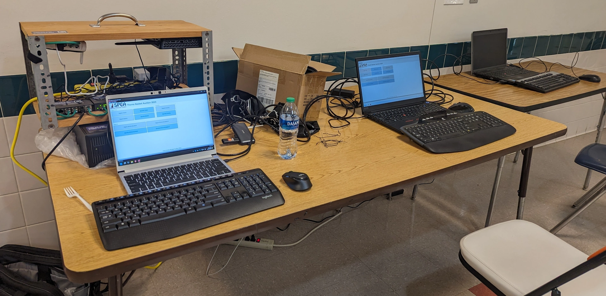

Over the course of my ownership of it so far, my Framework 13 has become quite the conversation piece. Either someone will notice that the brand emblem isn't familiar with them or they will ask me what kind of laptop it is and I'll watch them grow more and more confused as I say "Framework" over and over again.

<!--more-->

## A little background

Framework as a company started on the principle that users' devices should be repairable from top to bottom. So they set out to build their laptop with that idea. The Framework 13 was their first and the flagship for a while, named after the fact that it is a 13 inch form factor.

[Link to Framework's website](https://www.frame.work/)

Since then the Framework generations have been just named after the generation of the CPU that goes in them. The only changes so far are minor, on top of the newer CPU's, some small changes have been made; stiffer hinges, less tinny speakers.

Both of which can be easily upgraded on existing laptops via ordering the updated parts from Framework's website, and changing them out. A lot easier than the bigger laptop brands are.

Since their first release, Framework now has the 16, which as you may have guessed, is a 16 inch form factor laptop.

## How I got one

I saw that the 13th gen Intel models came out, since I had tried to get in on one of the first batches and ended up cancelling my preorder a while before they shipped. I noticed the delay wasn't projected to be that long this time around, so for $100 I decided to throw my hat in to get one, with a projected ship time of a week.

Four days later I get an email that my 13th gen Core i5 Framework 13 DIY edition is shipping.

## Initial Friction

When I received my Framework laptop, I was a little excited to have received it. Right away I slotted in the RAM included in my order and the Crucial P5-Plus NVMe which I had gotten a little better deal on than if I had ordered it through Framework.

And that's when I first powered it on and noticed that there was some damage to the screen. A rectangular green punchin along the left side which spawned flashing green lines both horizontal and vertical from it.

I reached out to Framework Support, which took 6 days to get a response, as they were busy at the time with the Framework 16 launch. I decided to install Windows on it anyway and start using it, even with the mild annoyance.

When Framework Support started answering, it took a couple of extra days of exchanging emails with them, taking and sending a massive amount of pics and videos, to get them to commit to sending a new screen in the mail.

Once I had gotten that screen, I was able to install it the same day. Since then it's all been sunshine and rainbows.

## My impressions 7 months in

Pictured are three laptops setup at the SPCA Theme Basket Auction during October of 2023. My Framework 13 is the one on the left.

So far, it's been good. Just a few mild annoyances.

* Screen is a bit small - For my eyes even the screen is a bit small. Even though it's not as straining as I expected it to be, it does get to my eyes a bit if I use it for a long time. Which makes upgrading to the 16 more and more tempting over time.
* Keyboard is a little clackity - This one I feel can be fixed, or will be fixed by the Framework team over time with a new input cover upgrade. So I won't complain too loud about this one for too long.
* Driver and BIOS updates take a long time - Still waiting on the LogoFAIL patch update for the BIOS especially. Maybe one day they'll release it and I can turn down the workaround security measures a bit.

All and all, my experience has been good with the Framework. Even though I have plenty of experience working on laptops, many of which were much less repair friendly than the Framework, I think it's almost easy enough to work on that many users with more than a few ounces of common sense can figure out how to use, maintain, and even customize one of the Framework laptops.

And to me that proves that companies reducing repairability of products for "convenience" or for a "user's protection" is pure BS and a money making scheme. Just my thoughts on the matter though.