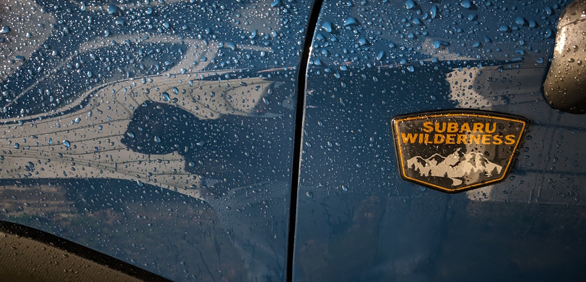
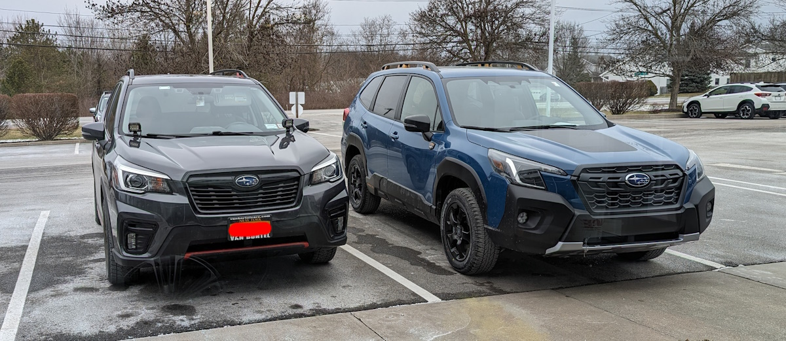
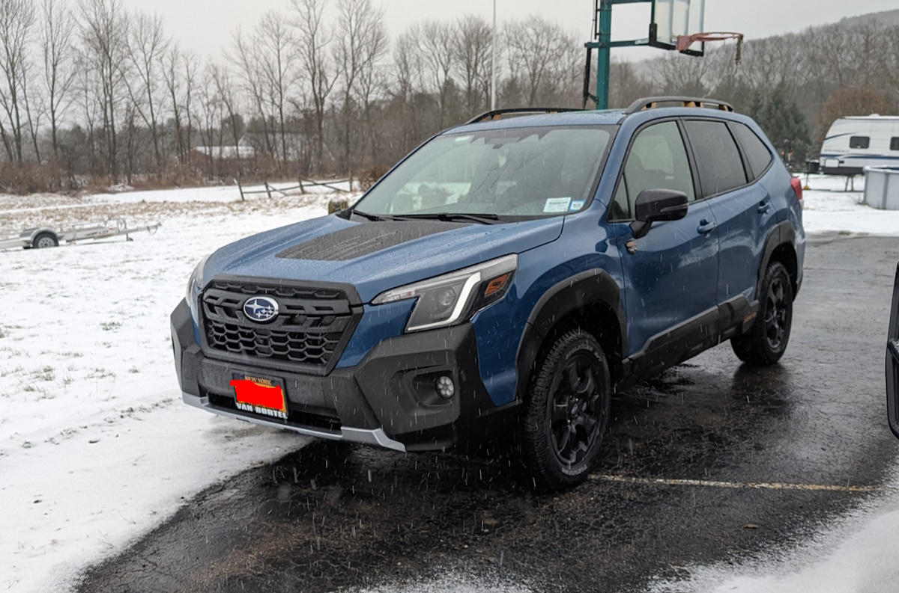

Today marks three and a half weeks with my 2024 Forester Wilderness. Man, time does fly when one is busy. And so far I like it. Of course I did like my 2020 Forester Sport.

Even though I try not to be a fanboy of any particular brand, it's hard for me personally to find things to dislike about Foresters.

Reasons why I upgraded:

- Extra half inch of ground clearance - For when I drive up slopes with my three bay bike rack extended, it'll be less likely to make contact
- Extra transmission cooler - I do occasionally tow with my vehicle or otherwise stress it by hauling both kayaks and bikes with it at the same time. I think it's best long-term to have a vehicle that has a real transmission cooler
- Always wanted a blue car - One of the things I missed about my Malibu was the nice blue color it had. Seems like everyone has a black or dark grey car these days. This one stands out a bit.

So far, so good. I'd also like to thank Van Bortel Subaru of Victor for a top-notch sales experience, like the past couple of times I've been to them.

