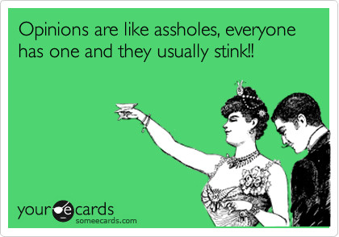

+++
date = '2024-03-14T09:42:04-04:00'
draft = false
title = 'TikTok and the Election'
+++

From what I'm seeing in the news, it looks like potential TikTok bans will play a role in the election.

[Article on NPR](https://www.npr.org/2024/03/14/1238435508/tiktok-ban-bill-congress-china)

From the last time I looked at it, it seemed as though most Democrat politicians were against banning TikTok. And now that whole paradigm has spun on its head. So what has happened?

Personally I think there's some information being withheld from the general public. I'll break down topic by topic what I think is really going on.

## How foreign hearings work

Even though perjury is still illegal when dealing with foreign hearings and legislative discovery processes, the problem is when one country tries to enforce against a perjurous act. Generally that is bound by specific alliances, such as the UN or NATO.

While China is in the UN, the UN has limited powers on what it can do, except for when there's overwhelming evidence that one country has perjured against another. It's pretty much on the honor system until said evidence is published.

I don't think the company behind TikTok, ByteDance, would have much incentive to perjur, there's one glaringly obvious fact here: They granted the PRC their own superuser credentials. This in turn, could allow the Chinese government to access the information it wants without making formal requests to ByteDance.

If it's not explicitly asked in the hearings if the Chinese government used their superuser credentials to access information about US citizens on TikTok, they don't have to divulge and therefore they have not committed perjury. Asking that likely won't happen because China will probably take it as an accusation.

## Intelligence Community

For all we know, our Intelligence Community may have stumbled upon some concerning data involving China's access on the platform. ByteDance, in a swift act to avoid the last potential ban, moved all data it has on US users to a datacenter in Texas which is controlled by US company Oracle.

This would mean that if the superuser credential granted to the PRC has access to said datacenter as well, it would be nearly impossible for them to skim off information on US users without being noticed by somebody at Oracle or our various three letter agencies.

Personally I feel that somebody is sitting on the smoking gun here and waiting for the correct time to reveal it to the world.

We all know that post-COVID, China will make a bunch of things happen in order to save face. Including, but not limited to, [making doctors disappear](https://www.foxnews.com/world/chinese-doctor-critics-who-first-raised-the-alarm-over-covid-19-vanishes).

So I think to avoid them doing that in the future, countries like the USA, will make sure to sit on enough evidence to where it will be impossible for them to make a few people disappear and deny everything, then release said evidence.

## Would it hamper free speech?

Personally, I don't think a TikTok ban would hamper free speech, at least not much more than the platform already does. TikTok uses extensive AI moderation which gets a lot of things wrong, including banning many who do screencasts for "illegal hacking."

The reason why many in the tech community create on TikTok as opposed to others, is that they get more views on said content. But are those views actually good if they don't have good comments and other engagements on the content? That's what I ask whenever I view some content and go over to the same or similar content on Youtube, seems like I can actually have a decent conversation with like-minded people on Youtube, Facebook, or Instagram than I can on TikTok.

And I'm not a huge fan of those platforms either. There's a reason why I write mostly on my own website now instead of posting to Facebook. Just for a while now they seem to feed me better content than TikTok has.

So, yeah, if the ban on TikTok is passed and signed; worst case scenario, US-based TikTok creators will start moving to other platforms like Youtube Shorts or FB Reels. Who knows? Maybe they'll see that the grass is greener on the other side and may wonder why they hadn't done it sooner.

