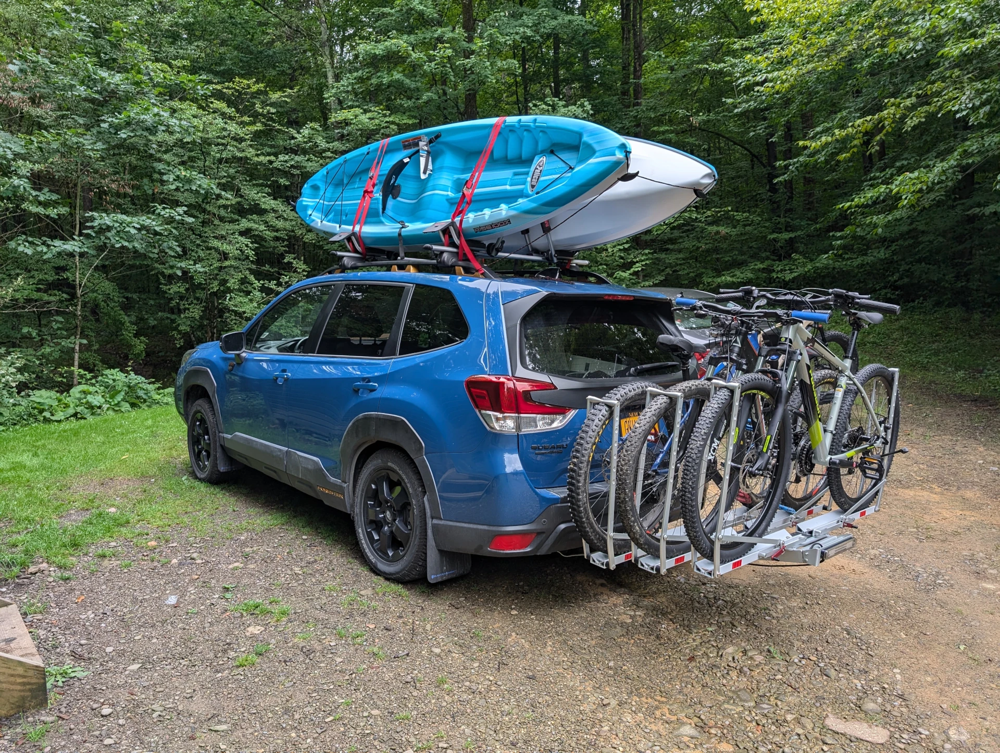

+++
date = '2024-08-19T11:00:50-04:00'
draft = false
title = 'Let them have Kei cars'
[params]
  comments = true
  toc = true
+++

In recent news, another state joins the odd movement of banning Kei cars, Massachusetts. More in [this article on ArsTechnica.com](https://arstechnica.com/cars/2024/08/states-keep-banning-cheap-little-kei-cars-for-fear-theyre-deathtraps/).

<!--more-->

## Another end to free choice

One of the best virtues of the United States as a country was the ability to choose, as a consumer, what products we as a people want to buy. And a few power players in the different industries are moving to change that because they want less competition.

So to me, journalists and various organizations pointing out that Kei cars are unsafe is a "no shit Sherlock" moment for me. Of course, when small car hits big car, big car will likely come out on top unless the small car is very, very dense. It doesn't take a big brain to tell people that. And it sure as hell shouldn't take a government organization IMO.

And that's the problem with this overreaching regulation. The lack of safety of Kei cars should only effect the owners/drivers of them and the very small occupants that they may stow away. It's actually a net benefit to those who are not driving Kei cars in a way.

Personally I don't see Japanese automakers actively tricking people into buying Kei cars. So owners of Kei cars know exactly what they're getting into by the time they get into registering one.

So if Kei cars aren't for Americans, let the market decide that. And that is coming from a man who will likely never own one myself. (unless I can figure out a way to use one to haul 3 bikes and 2 kayaks like the image below)

## Why are liberal states included?

One of the odd things about this effort of overreaching, is that liberal states are also joining in the efforts of banning Kei cars, including New York and Massachusetts. When Kei cars could be a good middle-ground between screwing the planet and going entirely to mass-transit systems.

The current challenges of EV's, range anxiety and initial price, could be solved entirely by building smaller EV's for the time being, including Kei-sized EV's. And banning them entirely wipes out this solution. So it just boggles my mind.

## The root of the problem

After doing a little research from a comment on the news article above, it all makes perfect sense.

One thing that the typical American doesn't know, is that a lot of states' policy is dictated by an organization called the American Association of Motor Vehicle Administrators, or "The AAMVA" for short.

This organization is entirely private, meaning that Americans don't get a voice in the policy they lobby for. And they are pretty active in lobbying and creating boilerplates for legislation. As said in the comment they don't seem to be a fan of Kei cars.

Even though as far as I can tell, the chairs of the AAMVA are usually commissioners of the DMV's of their respective states, there's got to be something in it for them. Maybe some extra revenue for charging people more for bigger cars (some jurisdictions charge more in title or registration fees based on weight or value).

Either way, entrusting legislation to a private organization is contrary to the values of a democratic republic, as people should be able to vote for the policies which dictate their lives to the point of determining what safety risks they're allowed to take on.
