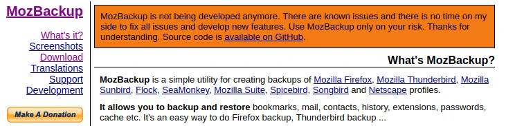
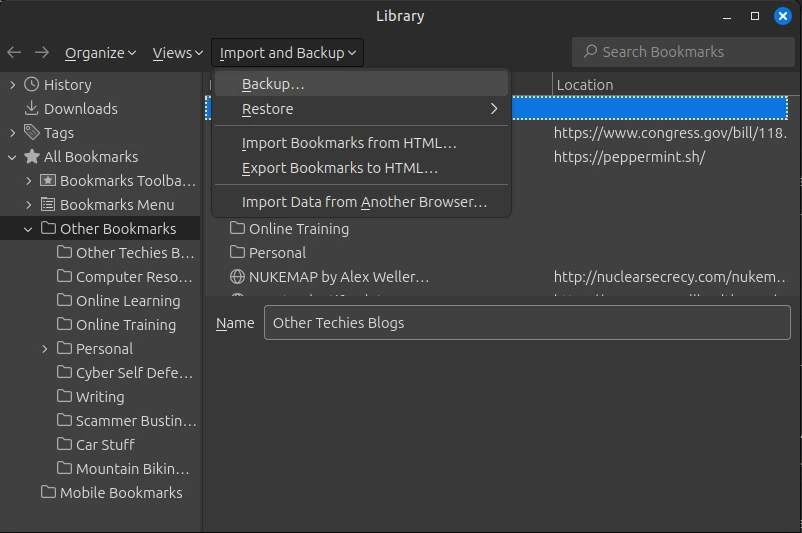

+++
date = '2024-09-07T21:16:14-04:00'
draft = false
title = 'Transferring Firefox Bookmarks'
[params]
  comments = true
+++

So you recently exchange someone's computer, then get asked to transfer their Firefox bookmarks, there is no Sync account setup so they're on the person's old computer. What's your plan of action?

For me, at least for a while, it was to pull the files off of the computer, and fetch them using MozBackup. Well, that was a no go this time around because of obvious reasons.

<!--more-->



So what is an old-school technician who has a hard time saying "I can't" supposed to do?

## The Plan

First step is to fire up the old computer in it's last known working condition to be able to pull this file directly, or what I did was to turn off BitLocker on the drive for the time being to have access to the files via an NVMe dock (computer was freezing and randomly BSOD'ing).

The plan I devised in the field, was to find out where Firefox saves its bookmarks files, pull them into a donor profile, then use its built-in backup and restore function. A little research showed me that in the Windows environment at my day job, it's stored in `%appdata%\Mozilla\Firefox\Profiles\string.default-release\places.sqlite`.

In Linux environments it should be in `~/.mozilla/firefox/string.default-release/places.sqlite`.

Sure enough, that worked as planned. I was able to pull the file and despite trying to drop it in place from my computer (don't try this if the user is currently using Firefox, or you'll have to delete their current working places.sqlite file and then restore), I was able to put it into my donor profile and get a working backup.json and exported.html files out of it, which imported just fine and with a little organization I was able to get them back into proper order for the user.

For those of you who aren't in the know, once you have your bookmarks in your donor profile (you can create one in Firefox by navigating to "about:profiles") you can open the Bookmarks Manager by clicking the Hamburger menu to the right of the address bar, then clicking Bookmarks, then Manage Bookmarks at the bottom of that menu. At the top of that dialog click Import and Backup. You can use those tools to your heart's content to figure out what you need to do (Backup and Restore preserves folders better. Export and Import tends to be more reliable, but requires more organization after the fact).



## Deep Dive

I was curious of what type of information was in said places.sqlite. So I decided to poke it with sqlite3. It had the following tables in it:

```
moz_anno_attributes
moz_keywords
moz_annos
moz_meta
moz_bookmarks
moz_origins
moz_bookmarks_deleted
moz_places
moz_historyvisits
moz_places_extra
moz_historyvisits_extra
moz_places_metadata
moz_inputhistory  
moz_places_metadata_search_queries
moz_items_annos
moz_previews_tombstones
```

I poked around in moz_bookmarks and it did in fact have my bookmarks. I'm guessing the other tables are as they say too. Maybe I'll poke around more if I have the time.
