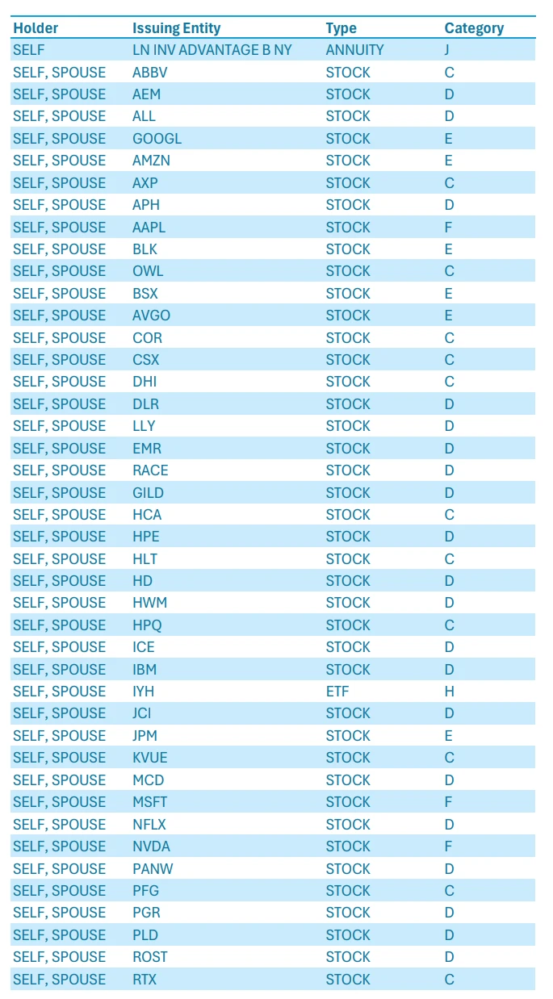

+++
title = 'Scam of the Century'
date = '2026-02-14T23:10:27-05:00'
draft = false
params.comments = true
+++

Have you ever wondered why the consumer price index has been increasing a lot faster than inflation? Like the cards are rigged against regular people all the time.

It's because they are. Let's dive into it because this one will get wild.

<!--more-->

## What's happening with electricity

The main thing driving up electricity costs is NOT electric cars or even high-efficiency heat pumps. As either one is like adding one more electric drier, considering that they likely operate on 240v and at around the same amperage (30-40a). No, not at all.

It's AI datacenters.

Why would that matter?

It's because AI companies are securing deals with power companies. They sometimes pay off utility commissions/committee members too, to get the power that they desire for pennies on the dollar. So the power companies are usually subsidizing the hookup and expansion costs to support such AI datacenters. So far it has been 6.6 GigaWatts of capacity.

The losses of those subsidies get backlogged onto the rest of homeowners and business owners. So essentially, everyone is forced to pay for this arms race that may replace their paychecks; whether they want to or not.

## Why our politicians are okay with it

You can never trust anything to a politician seeking reelection, that's one thing I have found out since I have been alive.

I suspect the reason why that's so is because of all of the lobbying money that these industries pay into. One other factor of consideration is what the politicians invest into while they're in office.

Because I live and work in NY, I know where to prod for information on this topic. One of the datapoints is the FDS (Financial Disclosure Statement).

Above is the first page of the investments section of a high level NY state politician; BLK (Blackrock), OWL (Blue Owl Capital), CSX (CSX Corporation), few others - Are real estate holdings companies, CSX also holds transportation assets. DLR (Digital Realty Trust), HPE (HP Enterprise), IBM (International Business Machines), MSFT (Microsoft), and others - Have vested interests in the success of AI datacenters.

And there are probably other NY state politicians with similar stock profiles. But that is the problem, when does holding stocks in the very entities they're supposed to regulate become a conflict of interest? I guess I'll let you answer that for yourself.

## When could it stop

Your guess is as good as mine. But if I were to guess, it will happen whenever the bubble decides to pop, and that's if it does.

Keep in mind that if it does pop there will be a lot of economic fallout from it doing so just due to how much is invested in AI currently. We could see a recession similar to 2008 or possibly worse.

Which is why the powers that be will keep pushing investments into AI as a technology. Or may rig the system to perpetually benefit it somehow to delay such a popping for as long as humanly possible.
