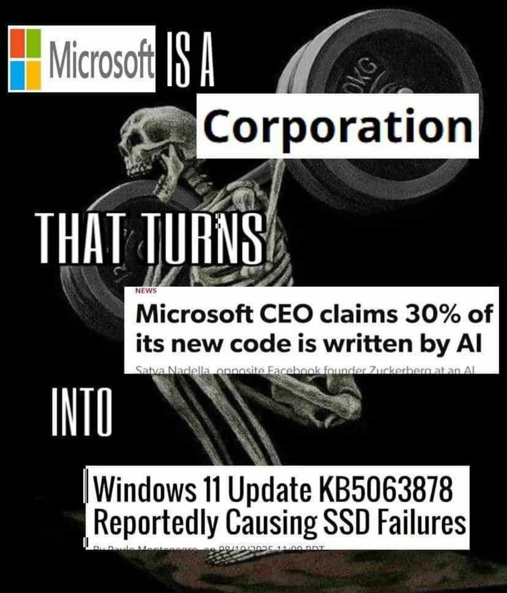

+++
lastmod = '2026-01-22T10:02:00-05:00'
title = 'Microsoft Meme'
draft = false
[menus.footer]
weight = 5
+++

So after seeing the following meme:

I decided to immortalize this in a text fashion with links to the news articles, so here goes.

(I'll probably update this as I think to)

## Microsoft is a Corporation that turns

[Satya Nadella says as much as 30% of Microsoft code is written by AI](https://www.cnbc.com/2025/04/29/satya-nadella-says-as-much-as-30percent-of-microsoft-code-is-written-by-ai.html) - Apr 29, 2025

## Into

[Microsoft Update Fails—New Download Breaks Windows](https://www.forbes.com/sites/zakdoffman/2025/05/18/microsoft-update-fails-new-download-breaks-windows/) - May 18, 2025

[Patch Chaos: Windows 11 Update Breaks PDF Printing](https://www.redhotcyber.com/en/post/patch-chaos-windows-11-update-breaks-pdf-printing/) - July 3, 2025

[Windows 10 KB5062554 update breaks emoji panel search feature](https://www.bleepingcomputer.com/news/microsoft/windows-10-kb5062554-update-breaks-emoji-panel-search-feature/) - July 13, 2025

[Potential SSD Detection Bug in Windows 11 24H2 Following Update KB5063878 (August 12, 2025)](https://learn.microsoft.com/en-us/answers/questions/5536733/potential-ssd-detection-bug-in-windows-11-24h2-fol) - Aug 27, 2025

[Recent Windows updates break Blu-ray and other protected video content playback on PC](https://www.techspot.com/news/109606-recent-windows-updates-break-blu-ray-other-protected.html) - Sept 24, 2025

[Microsoft Breaks Localhost with Windows 11 October Update, Users Forced to Revert](https://www.techpowerup.com/341976/microsoft-breaks-localhost-with-windows-11-october-update-users-forced-to-revert) - Oct, 16 2025

[Microsoft warns of Windows smart card auth issues after October updates](https://www.bleepingcomputer.com/news/microsoft/microsoft-october-security-updates-cause-windows-smart-card-auth-issues/) - Oct 20, 2025

[Windows 11 gets improved dark mode – but Microsoft breaks the feature for some unfortunate users](https://www.techradar.com/computing/windows/windows-11-gets-improved-dark-mode-but-microsoft-breaks-the-feature-for-some-unfortunate-users) - Oct 20, 2025

[Windows update breaks USB support in recovery mode](https://www.malwarebytes.com/blog/news/2025/10/windows-update-breaks-usb-support-in-recovery-mode) - Oct 21, 2025

[Windows 11 users hit with bizarre Task Manager duplication bug - here's how to avoid it](https://www.msn.com/en-us/news/technology/windows-11-users-hit-with-bizarre-task-manager-duplication-bug-heres-how-to-avoid-it/ar-AA1PBapJ?ocid=socialshare) - Oct 31, 2025

[Windows security update triggers BitLocker recovery in some systems](https://www.tomshardware.com/software/windows/windows-security-update-triggers-bitlocker-recovery-in-some-systems-bug-mostly-impacts-intel-pcs-with-modern-standby-support) - Nov 6, 2025

[Windows update makes sign-in password icon invisible](https://www.tomshardware.com/software/windows/windows-update-makes-sign-in-password-icon-invisible-microsoft-says-you-can-still-click-on-empty-space-to-enter-your-password) - Nov 30, 2025

[Microsoft's plan to speed up File Explorer in Windows 11 backfires: double the RAM, still slow](https://www.tweaktown.com/news/109138/microsofts-plan-to-speed-up-file-explorer-in-windows-11-backfires-double-the-ram-still-slow/index.html) - Nov 30, 2025

[Microsoft Issues update to allow users to shutdown their computers](https://www.windowscentral.com/microsoft/windows-11/microsoft-issues-emergency-out-of-band-update-for-windows-11-to-address-major-bugs-that-broke-pc-shutdowns-and-sign-ins) - Jan 18, 2026

## Bonus: AI Where it doesn't belong

[Enhance Your Writing with AI in Notepad](https://support.microsoft.com/en-us/windows/enhance-your-writing-with-ai-in-notepad-4088b954-c97b-46dc-813f-959be01746d5)
